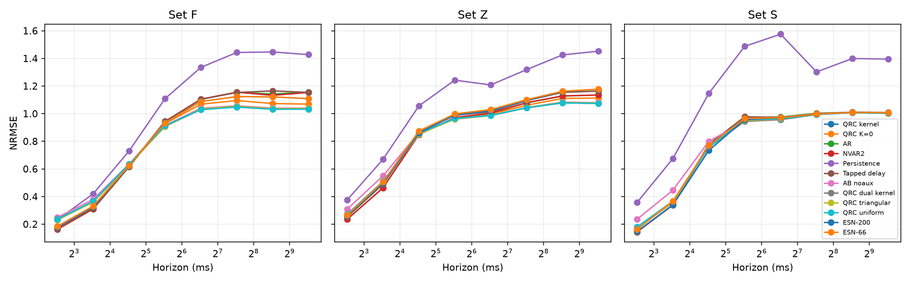

# EEG causal-memory gate report

## Mechanical verdict: **PASS**

Frozen rule: both F and Z must significantly favor the kernel over QRC K=0 and over the fitted classical comparator with the slowest degradation.

| Set | K=0 interaction | K=0 Holm p | K=0 condition | Strongest classical | Classical interaction | Classical Holm p | Classical condition |
|---|---:|---:|---|---|---:|---:|---|
| F | 0.0368 [0.0197, 0.0565] | 0.0005741 | PASS | NVAR2 | 0.1465 [0.0801, 0.2237] | 7.439e-05 | PASS |
| Z | 0.0319 [0.0157, 0.0517] | 0.0001144 | PASS | AR | 0.0851 [0.0462, 0.1331] | 0.000967 | PASS |

## NRMSE curves

Horizons are in samples and milliseconds at fs=173.61 Hz. Primary interaction endpoints are h=2 and h=64.

### Set F

| construction | 5.8 ms | 11.5 ms | 23.0 ms | 46.1 ms | 92.2 ms | 184.3 ms | 368.6 ms | 737.3 ms |
|---|---|---|---|---|---|---|---|---|
| AB noaux | 0.2486 | 0.3800 | 0.6351 | 0.9148 | 1.0396 | 1.0577 | 1.0406 | 1.0406 |
| AR | 0.1620 | 0.3097 | 0.6146 | 0.9407 | 1.1034 | 1.1557 | 1.1418 | 1.1565 |
| ESN-200 | 0.1786 | 0.3261 | 0.6209 | 0.9332 | 1.0882 | 1.1235 | 1.1217 | 1.1087 |
| ESN-66 | 0.1846 | 0.3315 | 0.6231 | 0.9327 | 1.0878 | 1.1236 | 1.1219 | 1.1091 |
| NVAR2 | 0.1620 | 0.3107 | 0.6177 | 0.9440 | 1.1053 | 1.1555 | 1.1327 | 1.1537 |
| QRC K=0 | 0.2304 | 0.3613 | 0.6328 | 0.9280 | 1.0684 | 1.0950 | 1.0736 | 1.0692 |
| QRC dual kernel | 0.2375 | 0.3653 | 0.6299 | 0.9071 | 1.0306 | 1.0482 | 1.0328 | 1.0338 |
| Persistence | 0.2319 | 0.4195 | 0.7296 | 1.1080 | 1.3350 | 1.4430 | 1.4468 | 1.4274 |
| QRC kernel | 0.2303 | 0.3600 | 0.6283 | 0.9100 | 1.0325 | 1.0520 | 1.0355 | 1.0362 |
| Tapped delay | 0.1669 | 0.3168 | 0.6189 | 0.9427 | 1.1036 | 1.1535 | 1.1651 | 1.1541 |
| QRC triangular | 0.2307 | 0.3602 | 0.6277 | 0.9098 | 1.0342 | 1.0531 | 1.0367 | 1.0374 |
| QRC uniform | 0.2349 | 0.3661 | 0.6338 | 0.9151 | 1.0287 | 1.0478 | 1.0318 | 1.0324 |

### Set Z

| construction | 5.8 ms | 11.5 ms | 23.0 ms | 46.1 ms | 92.2 ms | 184.3 ms | 368.6 ms | 737.3 ms |
|---|---|---|---|---|---|---|---|---|
| AB noaux | 0.3083 | 0.5496 | 0.8630 | 0.9648 | 0.9877 | 1.0451 | 1.0839 | 1.0799 |
| AR | 0.2357 | 0.4637 | 0.8498 | 0.9717 | 1.0035 | 1.0784 | 1.1273 | 1.1354 |
| ESN-200 | 0.2613 | 0.4971 | 0.8606 | 0.9902 | 1.0204 | 1.0950 | 1.1608 | 1.1766 |
| ESN-66 | 0.2657 | 0.5061 | 0.8743 | 0.9983 | 1.0297 | 1.1013 | 1.1625 | 1.1775 |
| NVAR2 | 0.2351 | 0.4626 | 0.8483 | 0.9722 | 1.0043 | 1.0799 | 1.1291 | 1.1352 |
| QRC K=0 | 0.2652 | 0.4999 | 0.8542 | 0.9693 | 0.9974 | 1.0614 | 1.1103 | 1.1134 |
| QRC dual kernel | 0.2715 | 0.5081 | 0.8555 | 0.9611 | 0.9862 | 1.0420 | 1.0778 | 1.0739 |
| Persistence | 0.3751 | 0.6698 | 1.0563 | 1.2429 | 1.2080 | 1.3192 | 1.4256 | 1.4526 |
| QRC kernel | 0.2666 | 0.5020 | 0.8523 | 0.9627 | 0.9873 | 1.0443 | 1.0805 | 1.0756 |
| Tapped delay | 0.2526 | 0.4895 | 0.8632 | 0.9883 | 1.0141 | 1.0944 | 1.1546 | 1.1632 |
| QRC triangular | 0.2662 | 0.5010 | 0.8514 | 0.9633 | 0.9869 | 1.0444 | 1.0811 | 1.0769 |
| QRC uniform | 0.2724 | 0.5097 | 0.8579 | 0.9662 | 0.9878 | 1.0430 | 1.0785 | 1.0734 |

### Set S

| construction | 5.8 ms | 11.5 ms | 23.0 ms | 46.1 ms | 92.2 ms | 184.3 ms | 368.6 ms | 737.3 ms |
|---|---|---|---|---|---|---|---|---|
| AB noaux | 0.2354 | 0.4460 | 0.7994 | 0.9451 | 0.9566 | 0.9942 | 1.0077 | 1.0027 |
| AR | 0.1436 | 0.3398 | 0.7761 | 0.9747 | 0.9758 | 1.0027 | 1.0105 | 1.0078 |
| ESN-200 | 0.1483 | 0.3388 | 0.7339 | 0.9564 | 0.9713 | 0.9964 | 1.0101 | 1.0078 |
| ESN-66 | 0.1626 | 0.3671 | 0.7688 | 0.9654 | 0.9722 | 0.9974 | 1.0096 | 1.0077 |
| NVAR2 | 0.1434 | 0.3384 | 0.7698 | 0.9679 | 0.9694 | 0.9996 | 1.0103 | 1.0064 |
| QRC K=0 | 0.1734 | 0.3621 | 0.7602 | 0.9638 | 0.9703 | 0.9983 | 1.0089 | 1.0042 |
| QRC dual kernel | 0.1751 | 0.3649 | 0.7568 | 0.9440 | 0.9572 | 0.9941 | 1.0071 | 1.0024 |
| Persistence | 0.3565 | 0.6749 | 1.1468 | 1.4874 | 1.5758 | 1.3024 | 1.3995 | 1.3952 |
| QRC kernel | 0.1697 | 0.3573 | 0.7570 | 0.9536 | 0.9630 | 0.9954 | 1.0073 | 1.0026 |
| Tapped delay | 0.1439 | 0.3408 | 0.7784 | 0.9776 | 0.9732 | 0.9996 | 1.0106 | 1.0091 |
| QRC triangular | 0.1709 | 0.3589 | 0.7583 | 0.9509 | 0.9628 | 0.9953 | 1.0073 | 1.0027 |
| QRC uniform | 0.1795 | 0.3671 | 0.7560 | 0.9566 | 0.9643 | 0.9948 | 1.0071 | 1.0025 |

## Useful horizon

| construction | set | useful_horizon | useful_horizon_ms | criterion |
|---|---|---|---|---|
| AB_noaux | Z | 16.0000 | 92.1606 | mean NRMSE < 1; bootstrap lower CI for persistence-model and AR-model > 0 |
| AR | Z | NA | NA | mean NRMSE < 1; bootstrap lower CI for persistence-model and AR-model > 0 |
| ESN | Z | NA | NA | mean NRMSE < 1; bootstrap lower CI for persistence-model and AR-model > 0 |
| ESN_66 | Z | NA | NA | mean NRMSE < 1; bootstrap lower CI for persistence-model and AR-model > 0 |
| NVAR2 | Z | NA | NA | mean NRMSE < 1; bootstrap lower CI for persistence-model and AR-model > 0 |
| QRC_K0 | Z | NA | NA | mean NRMSE < 1; bootstrap lower CI for persistence-model and AR-model > 0 |
| dual_kernel | Z | 16.0000 | 92.1606 | mean NRMSE < 1; bootstrap lower CI for persistence-model and AR-model > 0 |
| persistence | Z | NA | NA | mean NRMSE < 1; bootstrap lower CI for persistence-model and AR-model > 0 |
| single_kernel | Z | 16.0000 | 92.1606 | mean NRMSE < 1; bootstrap lower CI for persistence-model and AR-model > 0 |
| tapped_delay | Z | NA | NA | mean NRMSE < 1; bootstrap lower CI for persistence-model and AR-model > 0 |
| triangular | Z | 16.0000 | 92.1606 | mean NRMSE < 1; bootstrap lower CI for persistence-model and AR-model > 0 |
| uniform | Z | 16.0000 | 92.1606 | mean NRMSE < 1; bootstrap lower CI for persistence-model and AR-model > 0 |
| AB_noaux | F | 8.0000 | 46.0803 | mean NRMSE < 1; bootstrap lower CI for persistence-model and AR-model > 0 |
| AR | F | NA | NA | mean NRMSE < 1; bootstrap lower CI for persistence-model and AR-model > 0 |
| ESN | F | NA | NA | mean NRMSE < 1; bootstrap lower CI for persistence-model and AR-model > 0 |
| ESN_66 | F | NA | NA | mean NRMSE < 1; bootstrap lower CI for persistence-model and AR-model > 0 |
| NVAR2 | F | NA | NA | mean NRMSE < 1; bootstrap lower CI for persistence-model and AR-model > 0 |
| QRC_K0 | F | NA | NA | mean NRMSE < 1; bootstrap lower CI for persistence-model and AR-model > 0 |
| dual_kernel | F | 8.0000 | 46.0803 | mean NRMSE < 1; bootstrap lower CI for persistence-model and AR-model > 0 |
| persistence | F | NA | NA | mean NRMSE < 1; bootstrap lower CI for persistence-model and AR-model > 0 |
| single_kernel | F | 8.0000 | 46.0803 | mean NRMSE < 1; bootstrap lower CI for persistence-model and AR-model > 0 |
| tapped_delay | F | NA | NA | mean NRMSE < 1; bootstrap lower CI for persistence-model and AR-model > 0 |
| triangular | F | 8.0000 | 46.0803 | mean NRMSE < 1; bootstrap lower CI for persistence-model and AR-model > 0 |
| uniform | F | 8.0000 | 46.0803 | mean NRMSE < 1; bootstrap lower CI for persistence-model and AR-model > 0 |
| AB_noaux | S | 32.0000 | 184.3212 | mean NRMSE < 1; bootstrap lower CI for persistence-model and AR-model > 0 |
| AR | S | NA | NA | mean NRMSE < 1; bootstrap lower CI for persistence-model and AR-model > 0 |
| ESN | S | 32.0000 | 184.3212 | mean NRMSE < 1; bootstrap lower CI for persistence-model and AR-model > 0 |
| ESN_66 | S | 32.0000 | 184.3212 | mean NRMSE < 1; bootstrap lower CI for persistence-model and AR-model > 0 |
| NVAR2 | S | NA | NA | mean NRMSE < 1; bootstrap lower CI for persistence-model and AR-model > 0 |
| QRC_K0 | S | 4.0000 | 23.0401 | mean NRMSE < 1; bootstrap lower CI for persistence-model and AR-model > 0 |
| dual_kernel | S | 32.0000 | 184.3212 | mean NRMSE < 1; bootstrap lower CI for persistence-model and AR-model > 0 |
| persistence | S | NA | NA | mean NRMSE < 1; bootstrap lower CI for persistence-model and AR-model > 0 |
| single_kernel | S | 32.0000 | 184.3212 | mean NRMSE < 1; bootstrap lower CI for persistence-model and AR-model > 0 |
| tapped_delay | S | 32.0000 | 184.3212 | mean NRMSE < 1; bootstrap lower CI for persistence-model and AR-model > 0 |
| triangular | S | 32.0000 | 184.3212 | mean NRMSE < 1; bootstrap lower CI for persistence-model and AR-model > 0 |
| uniform | S | 32.0000 | 184.3212 | mean NRMSE < 1; bootstrap lower CI for persistence-model and AR-model > 0 |

## Frozen interaction family

| set | comparator | kernel_degradation | comparator_degradation | interaction_comp_minus_kernel | ci95_lo | ci95_hi | p_holm | significant_expected |
|---|---|---|---|---|---|---|---|---|
| Z | QRC_K0 | 0.5785 | 0.6104 | 0.0319 | 0.0157 | 0.0517 | 0.0001 | True |
| Z | AR | 0.5785 | 0.6636 | 0.0851 | 0.0462 | 0.1331 | 0.0010 | True |
| Z | NVAR2 | 0.5785 | 0.6665 | 0.0880 | 0.0500 | 0.1361 | 0.0003 | True |
| Z | persistence | 0.5785 | 0.7558 | 0.1773 | 0.1451 | 0.2113 | 0.0000 | True |
| Z | tapped_delay | 0.5785 | 0.6651 | 0.0866 | 0.0357 | 0.1512 | 0.0006 | True |
| F | QRC_K0 | 0.6755 | 0.7123 | 0.0368 | 0.0197 | 0.0565 | 0.0006 | True |
| F | AR | 0.6755 | 0.8322 | 0.1567 | 0.0848 | 0.2388 | 0.0002 | True |
| F | NVAR2 | 0.6755 | 0.8220 | 0.1465 | 0.0801 | 0.2237 | 0.0001 | True |
| F | persistence | 0.6755 | 1.0273 | 0.3518 | 0.2881 | 0.4265 | 0.0000 | True |
| F | tapped_delay | 0.6755 | 0.8483 | 0.1728 | 0.0917 | 0.2661 | 0.0002 | True |
| S | QRC_K0 | 0.6500 | 0.6469 | -0.0031 | -0.0092 | 0.0030 | 0.2455 | False |
| S | AR | 0.6500 | 0.6706 | 0.0206 | 0.0131 | 0.0291 | 0.0002 | True |
| S | NVAR2 | 0.6500 | 0.6719 | 0.0218 | 0.0131 | 0.0310 | 0.0007 | True |
| S | persistence | 0.6500 | 0.7246 | 0.0746 | 0.0237 | 0.1290 | 0.0592 | False |
| S | tapped_delay | 0.6500 | 0.6697 | 0.0197 | 0.0117 | 0.0291 | 0.0006 | True |

## Deviations

None. The degree-2 NVAR uses the preregistered selected AR lag window with linear coordinates and their diagonal quadratic powers.

The gate concerns held-out benchmark segments, not patients; Bonn segment-to-subject mapping is unavailable and no subject-level generalization is claimed.
